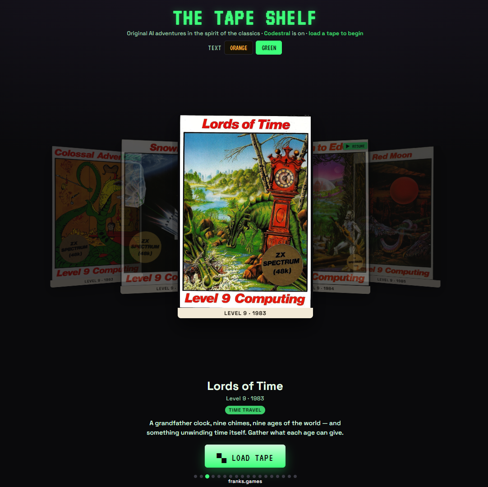

# The Tape Shelf

Original AI text adventures in one page. Open [`index.html`](index.html) in a browser. Codestral is already on. Load a tape and type what you do.

Each tape is labelled with the title, year, and publisher of a classic. The cover, the brief, and the game you play are original. The engine is told to invent its own rooms, puzzles, and prose but this is almost identical to the original...

## Adventures

| Tape | Year | Publisher | Tag | On the sleeve |
| --- | --- | --- | --- | --- |
| Colossal Adventure | 1983 | Level 9 | Cave · Treasure | A mist-wet cave mouth in the hills, an underground world beneath, and a fortune in treasures to carry back into the light. |
| Snowball | 1983 | Level 9 | Hard SF · Survival | You wake alone in cryo-bay aboard a colony sleeper-ship drifting toward a frozen world. The crew never woke. Bring her down. |
| Lords of Time | 1983 | Level 9 | Time Travel | A grandfather clock, nine chimes, nine ages of the world — and something unwinding time itself. Gather what each age can give. |
| Return to Eden | 1984 | Level 9 | Sci-Fi · Alien World | Falsely accused, you flee across a living alien planet toward the machine-city of Enoch, plants watching your every step. |
| Red Moon | 1985 | Level 9 | Fantasy · Magic | The great crystal that powers all magic has been stolen. Under a bleeding red moon, take up spell and sword to bring it home. |
| Knight Orc | 1987 | Level 9 | Fantasy · Twist | You are the orc — hunted across a land of smug knights and clever folk who all want you dead. Survive. Then turn the tables. |
| The Worm in Paradise | 1985 | Level 9 | Dystopia | A gleaming future city that runs itself, a citizen who asks the wrong questions, and a rot beneath the chrome. |
| Dungeon Adventure | 1984 | Level 9 | Dungeon · Magic | The demon lord is slain; his dungeon lies open and unguarded. One hundred rooms of loot, traps, and leftover spells await. |
| Emerald Isle | 1985 | Level 9 | Island · Mystery | You parachute onto a green island you cannot leave — and find a lost people who have been waiting a very long time for you. |
| Zork | 1980 | Infocom | Underground Empire | A field, a trap-door, and a brass lantern. Below your feet sprawls a ruined underground empire that does not want to be mapped. |
| The Hitchhiker's Guide | 1984 | Infocom | Comic SF | Your house is being demolished. So, shortly, is your planet. Grab something soft, keep your head, and try to enjoy the absurdity. |
| Planetfall | 1983 | Infocom | SF · Companion | Your ship blows up. You wash ashore on a deserted world with one small, hopelessly loyal robot and a very bad feeling. |
| The Lurking Horror | 1987 | Infocom | Horror | Alone in a tech institute during a snowstorm, working late in the basement labs. Something down there is very much awake. |
| Spider and Web | 1998 | A. Plotkin | Spy · Puzzle | An ordinary street, an ordinary wall — and an interrogator who does not believe a word of the story you are being made to tell. |
| Trinity | 1986 | Infocom | Fantasy · History | A sunlit London park, a white door in the air, and a countdown that has been running since the dawn of the atomic age. |
| Scapeghost | 1989 | Level 9 | Ghost · Detective | You died in disgrace, framed and buried. You have three nights as a ghost to clear your name and save your partner. |
| Roadwarden | 2022 | Moral Anxiety | RPG · Diplomacy | A hired road-warden on a remote, half-pagan peninsula: map it, treat with its wary villages, and outlast a shortening autumn. |
| The Dreamhold | 2004 | A. Plotkin | Fantasy · Gentle | You wake with no memory in a mask-hung tower of a vanished mage. Learn its rooms, its words, and slowly, yourself. |

## Features

### Shelf

- Eighteen cover cards, drawn as original SVG inlays.
- Move with the arrows, the dots, a swipe, or the left and right keys. Enter loads the tape in front.
- The row advances on its own. It stays still when the browser asks for reduced motion, and while the pointer is over the cards.
- A tape you have already played shows **RESUME** and “saved game in progress”.

### Play

- Commands are ordinary language. The prompt is `what do you do?`
- The bar shows the current place, score, move count, and inventory.
- A 1920×1440 picture appears when you enter a new place or hit a reveal. Other turns stay as text.
- Score runs from 0 to 350 and moves when you make real progress.
- If the opening turn does not arrive, type `LOOK`.
- **SHELF** leaves the game and keeps the position.

### Saves

- One save per tape, in this browser only (`localStorage`).
- The position is written after each turn, when you press **SAVE**, and when you go back to the shelf.
- Loading a saved tape restores the transcript, score, inventory, moves, and the world summary the engine is using.
- A restored game asks you to type `LOOK` to get your bearings.

### Text and phones

- Text is orange by default. Green is the other choice. It is remembered in this browser.
- The switch is under the title, on the two colour chips while you play, and at the top of **ENGINE**. It applies straight away.
- On a phone the shelf and the play screen reflow, the targets get larger, and the command line stays above the keyboard.

### Voice

- **TTS** reads each reply aloud. It prefers a British English voice.
- The microphone button takes one spoken command and sends it.
- A button hides itself when that browser has no speech support.

### Engine

Each turn is one chat completion on an OpenAI-compatible `/v1/chat/completions` endpoint. A key you type stays in this browser. It is not in this repository.

| Preset | Endpoint | Starting model | Key |
| --- | --- | --- | --- |
| LLM7 | `https://api.llm7.io/v1` | `codestral-latest` | none; this is the default |
| OVH | `https://oai.endpoints.kepler.ai.cloud.ovh.net/v1` | `Mistral-Nemo-Instruct-2407` | none; about 2 turns a minute |
| llama.cpp | `http://127.0.0.1:8787/v1` | first model that server lists | none |
| Ollama | `http://127.0.0.1:11434/v1` | first model that server lists | none |
| xAI | `https://api.x.ai/v1` | `grok-4` | required |
| OpenRouter | `https://openrouter.ai/api/v1` | `openrouter/auto` | required |
| OpenAI | `https://api.openai.com/v1` | you choose | required |
| Mistral | `https://api.mistral.ai/v1` | `mistral-small-latest` | required |

- Clicking a preset saves it at once. **TEST** checks that the endpoint answers. **SAVE** keeps a hand-typed endpoint, model, and key.
- Search lists models for OVH, OpenRouter, OpenAI, and Mistral.
- A setup you saved, including one with a real key, is kept. An empty key on OpenAI, Mistral, xAI, or OpenRouter, and the old localhost llama.cpp default with no model, are replaced with LLM7 the next time the page loads.
- If OVH answers with a rate limit, that turn switches to LLM7 and stays there. If LLM7 is rate limited, the turn is tried once more after a short wait. The line on screen is: “The free engine is busy. Wait a minute, then type LOOK.”
